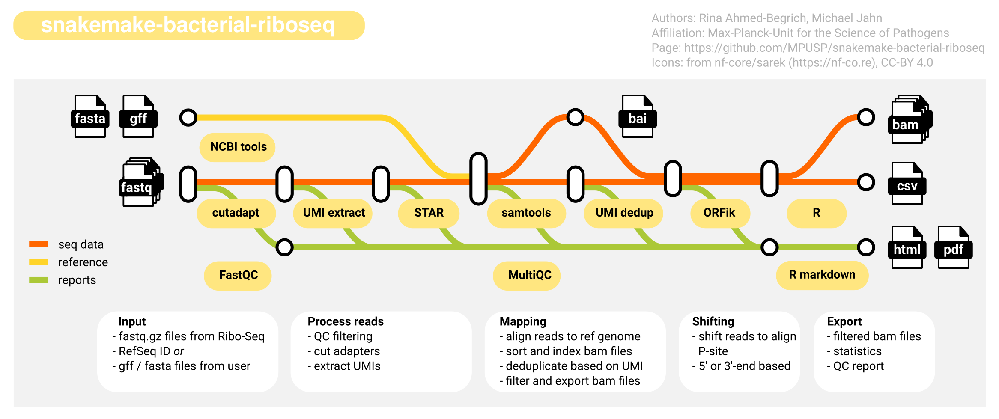

# snakemake-bacterial-riboseq

[](https://snakemake.github.io)
[](https://github.com/MPUSP/snakemake-bacterial-riboseq/actions/workflows/snakemake-tests.yml)
[](https://docs.conda.io/en/latest/)
[](https://sylabs.io/docs/)
[](https://snakemake.github.io/snakemake-workflow-catalog)

---

A Snakemake workflow for the analysis of bacterial riboseq data.

- [snakemake-bacterial-riboseq](#snakemake-bacterial-riboseq)
  - [Usage](#usage)
  - [Workflow overview](#workflow-overview)
  - [Deployment options](#deployment-options)
  - [Running the workflow](#running-the-workflow)
    - [Input data](#input-data)
      - [Reference genome](#reference-genome)
      - [Read data](#read-data)
  - [Authors](#authors)
  - [References](#references)

## Usage

The usage of this workflow is described in the [Snakemake Workflow Catalog](https://snakemake.github.io/snakemake-workflow-catalog/docs/workflows/MPUSP/snakemake-bacterial-riboseq.html).

Detailed information about input data and workflow configuration can be found in the [`config/README.md`](config/README.md).

If you use this workflow in a paper, don't forget to give credits to the author(s) by citing the URL of this repository, the release, and its DOI if available.

## Workflow overview



---

This workflow is a best-practice workflow for the analysis of ribosome footprint sequencing (Ribo-Seq) data.

The workflow is built using [snakemake](https://snakemake.readthedocs.io/en/stable/) and consists of the following steps:

1. Obtain genome database in `fasta` and `gff` format (`python`, [NCBI Datasets](https://www.ncbi.nlm.nih.gov/datasets/docs/v2/))
    1. Using automatic download from NCBI with a `RefSeq` ID
    2. Using user-supplied files
2. Check quality of input sequencing data (`FastQC`)
3. Cut adapters and filter by length and/or sequencing quality score (`cutadapt`)
4. Deduplicate reads by unique molecular identifier (UMI, `umi_tools`)
5. Map reads to the reference genome (`STAR aligner`)
6. Sort and index for aligned seq data (`samtools`)
7. Filter reads by feature type (`bedtools`)
8. Generate summary report for all processing steps (`MultiQC`)
9. Shift ribo-seq reads according to the ribosome's P-site alignment (`R`, `ORFik`)
10. Calculate basic gene-wise statistics such as RPKM (`R`, `ORFik`)
11. Return report as HTML and PDF files (`R markdown`, `weasyprint`)

If you want to contribute, report issues, or suggest features, please get in touch on [github](https://github.com/MPUSP/snakemake-bacterial-riboseq).

## Deployment options

To run the workflow from command line, change the working directory.

```bash
cd path/to/snakemake-bacterial-riboseq
```

Adjust options in the default config file `config/config.yml`.
Before running the complete workflow, you can perform a dry run using:

```bash
snakemake --dry-run
```

To run the workflow with test files using **conda**:

```bash
snakemake --cores 2 --sdm conda --directory .test
```

To run the workflow with test files using **apptainer**:

```bash
snakemake --cores 2 --sdm conda apptainer --directory .test
```

## Running the workflow

### Input data

#### Reference genome

An NCBI Refseq ID, e.g. `GCF_000006945.2`. Find your genome assembly and corresponding ID on [NCBI genomes](https://www.ncbi.nlm.nih.gov/data-hub/genome/). Alternatively use a custom pair of `*.fasta` file and `*.gff` file that describe the genome of choice.

Important requirements when using custom `*.fasta` and `*.gff` files:

- `*.gff` genome annotation must have the same chromosome/region name as the `*.fasta` file (example: `NC_003197.2`)
- `*.gff` genome annotation must have `gene` and `CDS` type annotation that is automatically parsed to extract transcripts
- all chromosomes/regions in the `*.gff` genome annotation must be present in the `*.fasta` sequence
- but not all sequences in the `*.fasta` file need to have annotated genes in the `*.gff` file

#### Read data

Ribosome footprint sequencing data in `*.fastq.gz` format. The currently supported input data are **single-end, strand-specific reads**. Input data files are supplied via a mandatory table, whose location is indicated in the `config.yml` file (default: `samples.tsv`). The sample sheet has the following layout:

| sample   | condition | replicate | fq1                           |
| -------- | --------- | --------- | ----------------------------- |
| RPF-RTP1 | RPF-RTP   | 1         | data/RPF-RTP1_R1_001.fastq.gz |
| RPF-RTP2 | RPF-RTP   | 2         | data/RPF-RTP2_R1_001.fastq.gz |

Some configuration parameters of the pipeline may be specific for your data and library preparation protocol. The options should be adjusted in the `config.yml` file. For example:

- Minimum and maximum read length after adapter removal (see option `cutadapt: default`). Here, the test data has a minimum read length of 15 + 7 = 22 (2 nt on 5'end + 5 nt on 3'end), and a maximum of 45 + 7 = 52.
- Unique molecular identifiers (UMIs). For example, the protocol by [McGlincy &amp; Ingolia, 2017](https://doi.org/10.1016/J.YMETH.2017.05.028) creates a UMI that is located on both the 5'-end (2 nt) and the 3'-end (5 nt). These UMIs are extracted with `umi_tools` (see options `umi_extraction: method` and `pattern`).

Example configuration files for different sequencing protocols can be found in `resources/protocols/`.

## Authors

- Dr. Rina Ahmed-Begrich
    - Affiliation: [Max-Planck-Unit for the Science of Pathogens](https://www.mpusp.mpg.de/) (MPUSP), Berlin, Germany
    - ORCID profile: https://orcid.org/0000-0002-0656-1795
    - github page: https://github.com/rabioinf
- Dr. Michael Jahn
    - Affiliation: [Max-Planck-Unit for the Science of Pathogens](https://www.mpusp.mpg.de/) (MPUSP), Berlin, Germany
    - ORCID profile: https://orcid.org/0000-0002-3913-153X
    - github page: https://github.com/m-jahn

Visit the MPUSP github page at https://github.com/MPUSP for more info on this workflow and other projects.

## References

- Essential tools are linked in the top section of this document
- The sequencing library preparation is based on the publication:

> McGlincy, N. J., & Ingolia, N. T. _Transcriptome-wide measurement of translation by ribosome profiling_. Methods, 126, 112–129, **2017**. https://doi.org/10.1016/J.YMETH.2017.05.028.
